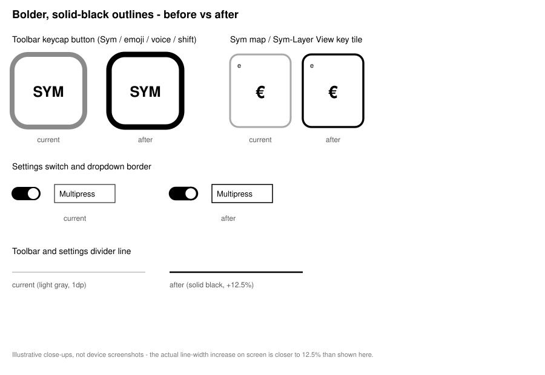

# Changelog

## 0.92 - 2026-09-22

### Changed
- Outlines and dividers are now solid black and about 12.5% thicker, replacing a light gray that was hard to see on the e-ink screen: the toolbar keycap buttons (Sym, emoji, voice, shift), the key tiles in the Sym map and the Sym-Layer View, the settings switches and dropdown borders, and the toolbar/settings divider lines.

- The common word list grows from 30,000 to 50,000 words, so fewer real words and names are wrongly flagged as typos and more of them can be completed.
- The built in spell checker (used when no system one is turned on) now catches more typos at the Medium and High auto-correct levels, instead of only ever a single letter change.

### Added
- A word the spell checker does not recognize, like a name or a brand, already showed up as a suggestion that could be tapped to save it. Now it is also learned on its own, the same as tapping it would, once it has been typed more than twice, so a word that keeps coming up does not have to be saved by hand every time.
