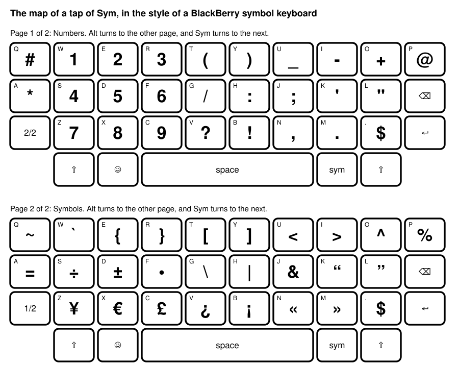
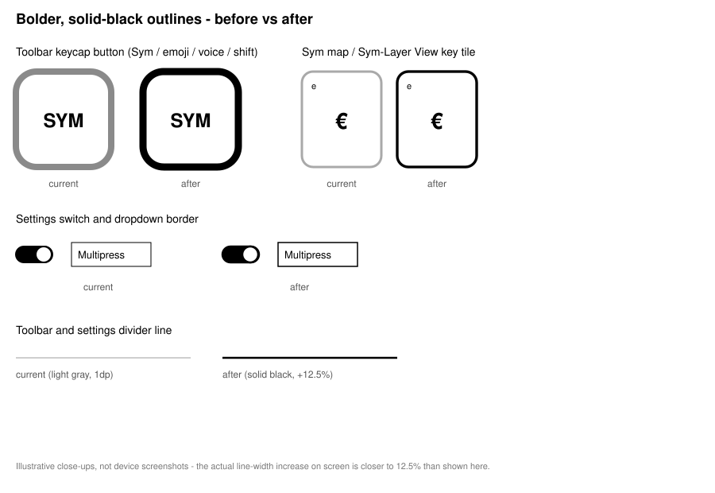

# Changelog

## 0.95 - 2026-10-02

### Changed
- The map that a tap of `Sym` opens is now laid out like the symbol keyboard of a BlackBerry, in two pages: numbers and punctuation, then other symbols, with the dollar sign on the key after M on both. These are all the symbols it shows. The Alt, press-again and accent pages are gone from the map; those keys still type as before.
- After a tap of `Sym`, the next key types what is on the page that the map shows, and then Sym turns off. Tap `Sym` again for the next page (the tap after the last page closes it), or tap `Alt` to turn to the other page, like the page key of a BlackBerry. Back closes the map.
- Holding `Sym` is still the layer of the cursor and editing keys (arrows, home, end, page up and down, tab, cut, copy and paste), for as long as it is held.

### Fixed
- After a tap of `Sym`, the next key typed its plain letter instead of its symbol.
- Holding `Sym`, pressing a key and letting go quickly no longer counts as a tap, so the map does not open afterwards.

## 0.94 - 2026-10-02

### Changed
- A tap of `Sym` now only opens, pages through, or closes the map of the keyboard; it no longer leaves Sym on for the keys that follow. Typing a symbol or using the Sym+WASD cursor keys now needs Sym to be held, the same as any other modifier.
- The map of the keyboard is about 1.5 times bigger, with larger keys and text, to read more easily on the e-ink screen.

### Fixed
- The map of the keyboard did not close on its last page: the tap meant to close it reopened it instead. Pressing Back while the map was open also hid the whole keyboard instead of just closing the map.

## 0.93 - 2026-09-22

### Added
- A `Dictionary language` setting picks whether the built in common words, and the built in spell checker used when none is turned on in Android's settings, are English, Spanish or French.

### Changed
- The common word lists grow from 50,000 to 100,000 words each, and there are now separate 100,000-word lists for Spanish and French, not only English.
- Each dictionary then grows further to as many real words as could be sourced for that language, instead of a round 100,000: English 162,070, Spanish 161,917, French 140,112.

## 0.92 - 2026-09-22

### Changed
- Outlines and dividers are now solid black and about 12.5% thicker, replacing a light gray that was hard to see on the e-ink screen: the toolbar keycap buttons (Sym, emoji, voice, shift), the key tiles in the Sym map and the Sym-Layer View, the settings switches and dropdown borders, and the toolbar/settings divider lines.

- The common word list grows from 30,000 to 50,000 words, so fewer real words and names are wrongly flagged as typos and more of them can be completed.
- The built in spell checker (used when no system one is turned on) now catches more typos at the Medium and High auto-correct levels, instead of only ever a single letter change.

### Added
- A word the spell checker does not recognize, like a name or a brand, already showed up as a suggestion that could be tapped to save it. Now it is also learned on its own, the same as tapping it would, once it has been typed more than twice, so a word that keeps coming up does not have to be saved by hand every time.
